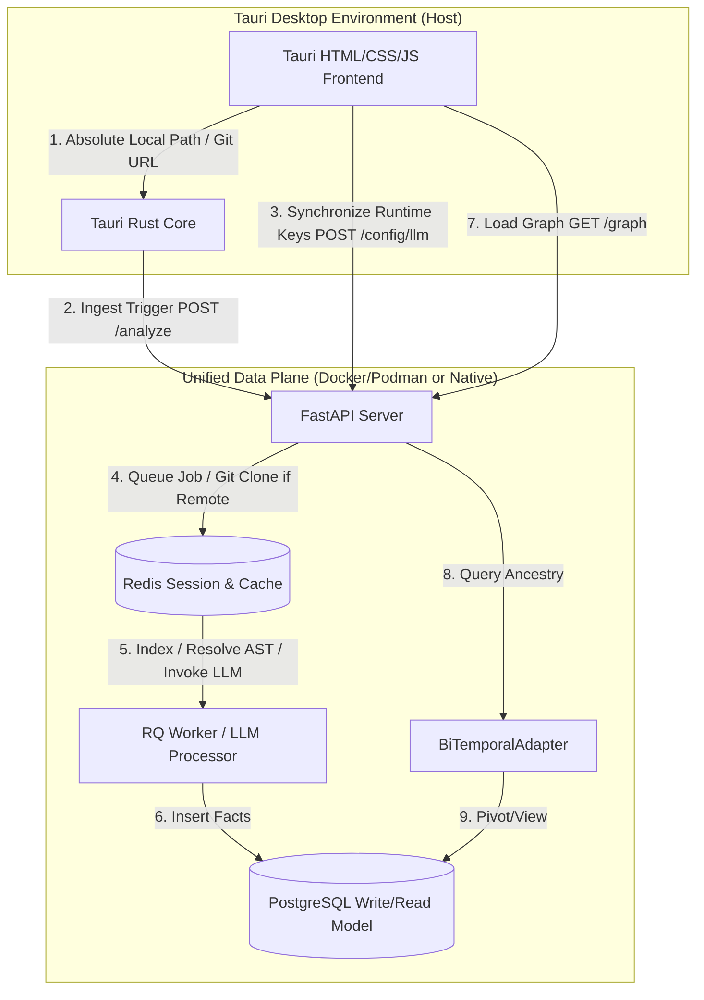

# Architectural Decision Record (ADR-002)

## Title
Decoupled Desktop-to-Backend Integration Plan for Code-Intel with Versioned Graph Exploration

## Context & Problem Statement
The current version of the `code-intel-desktop` client is a mock-heavy Tauri shell. To make it a true frontend for the `code-intel` platform, we must integrate it with the versioned relational Git-DAG back-end.

We need to resolve five primary challenges:
1. **FileSystem isolation:** How a containerized back-end reads local repositories chosen by the Tauri file dialog.
2. **Visual complexity and scalability:** Rendering dense call graphs without browser freeze.
3. **Data synchronisation:** Ensuring timeline-travel, branch/commit switching, search, and requirements generation remain consistent and aligned with the backend's topological storage paradigms.
4. **Remote Repositories Ingestion:** How the UI supports seamless remote Git repository paths (HTTPS/SSH) alongside local workspace files.
5. **Runtime LLM Configuration Dynamic Handshake:** Syncing frontend-defined LLM parameters (Provider, Model Name, and API Key) securely with backend asynchronous generation tasks.
6. **Graceful Offline Resilience:** Handling physical network or endpoint disconnections gracefully.

This ADR defines the formal architectural blueprint, system and deployment design, and a phased rollout plan.

## Proposed System Design & Diagram



## Proposed Integration & Deployment Topology

```mermaid
deploymentNode "Developer Desktop (Host System)" {
    node "Tauri UI Shell" {
        component [Cytoscape Canvas] as cy
        component [File Tree View] as tree
        component [Timeline Slider] as timeline
        component [LLM Settings Form] as settings
    }

    node "Tauri Rust Process" {
        component [Tauri FS & Shell Plugins] as tauri_core
    }

    node "Podman-Compose Stack" {
        node "codeintel-api (Container)" {
            component [FastAPI App] as backend
        }
        node "codeintel-redis (Container)" {
            database [Redis Key-Value] as cache_redis
        }
        node "codeintel-postgres (Container)" {
            database [Postgres DB / Timescale] as db_sql
        }
    }
}

cy --> backend
tree --> backend
timeline --> backend
settings --> backend
backend --> cache_redis
backend --> db_sql
```

---

## Phased Implementation Plan

### Phase 1: Service Validation & Path Invariant Handshake (Week 1)
* **Goal:** Establish secure, CORS-free communication and resolve directory paths.
* **Tauri Core Work:**
  * Configure Tauri's HTTP plugin to communicate with `localhost:8000`.
  * Create a system validation check on start to detect if the backend is running inside Docker. If yes, query for a shared filesystem mount path.
* **FastAPI Backend Work:**
  * Implement endpoint `GET /api/status` to return platform details, database connection status, and whether the service runs inside Docker.

### Phase 2: Streaming Ingestion & Real-time Progress (Week 2)
* **Goal:** Support smooth repository selection (both local paths and remote Git URLs) and feedback.
* **Tauri UI Work:**
  * Bind the "Browse Repo" button to Tauri's native `dialog.open` plugin.
  * Add a "Clone Remote Repo" form allowing input of Git URLs (HTTPS/SSH) and target branch specifications.
  * Establish an EventSource connection to the backend's stream to display a progress percentage and currently parsed file names.
* **FastAPI Backend Work:**
  * Create an SSE endpoint `/analyze/stream` that tracks indexing progress from the Redis job queue and transmits the data to the client.
  * Integrate automatic transient space cloning via `GitRepoHandler` for remote repos.

### Phase 3: Dynamic LLM Settings Sync & Timeline Travel Panel (Week 3)
* **Goal:** Synchronize LLM context parameters on-the-fly and navigate branches/commits.
* **Tauri UI Work:**
  * Render a sidebar dropdown populated with all repository branches.
  * Implement a vertical Commit Timeline rail (Commit Travel) that lists SHAs, authors, and timestamps.
  * Synchronize saved Settings (Provider, Model Name, API Key) to the backend via `POST /config/llm` upon form submission.
* **FastAPI Backend Work:**
  * Add `POST /config/llm` endpoint that dynamically binds local session or process environment values to the requirements generator pipeline.
  * Add `GET /repo/branches-and-commits` which parses the Git-DAG ancestry list of the selected repository.
  * Add `GET /repo/tree?version=<commit_sha>` which returns the directory structure filtered by bitemporal ancestry.

### Phase 4: Compound level-of-Detail Cytoscape Renderer (Week 4)
* **Goal:** Solve the viewport density bottleneck.
* **Tauri UI Work:**
  * Implement **lazy expansion**: upon initial load, request only high-level FileNodes.
  * Double-clicking a FileNode fetches definition symbols for that specific file and embeds them as Cytoscape compound children.
  * Color-code nodes by definition kinds (Functions, Classes, Modules).
* **FastAPI Backend Work:**
  * Create `GET /graph?version=<commit_sha>` to return a streamlined Cytoscape-compatible node/edge JSON dictionary.

### Phase 5: Grounded Requirements & Traceability (Week 5)
* **Goal:** Close the requirement-code loop.
* **Tauri UI Work:**
  * Enable multi-select (Shift+Click) on Cytoscape nodes.
  * Pipe selected symbol IDs into the Requirements Generation workspace modal.
  * Stream requirements output using `/requirements/stream` and display real-time traceability matrices.

---

## Architectural Consequences

### Positive
* **Scalable Render Performance:** By migrating to Level-of-Detail (LOD) node expansions, the app can handle codebases of any size (>50k lines of code) without rendering lag.
* **Complete Time-Travel:** Leveraging bitemporal version queries enables consistent, snapshot-accurate timeline travel across different commits.
* **Flexible Sourcing:** Direct support for remote branches allows developers to analyze repositories instantly without pre-cloning them locally.
* **Dynamic, Secure Key Handshake:** Passing LLM parameters dynamically ensures remote generation works securely on any client infrastructure without pinning hardcoded API keys in backend configurations.
* **Graceful Offline Protection:** Keeps the visual interface fully explorable in read-only mode during physical connectivity losses.
* **True Local Privacy:** No code or structural data leaves the user's host machine.

### Negative
* **Path Mounting Friction:** Containerized backend setups require manual folder mounting mapping configs if native local paths are used.
* **Ollama/GPU Dependency:** Requirements generation can be slow if local GPU acceleration is not present on the host.
