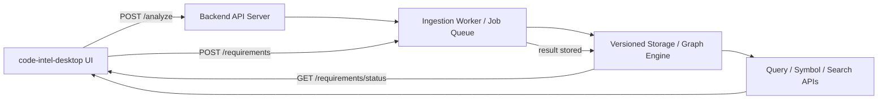
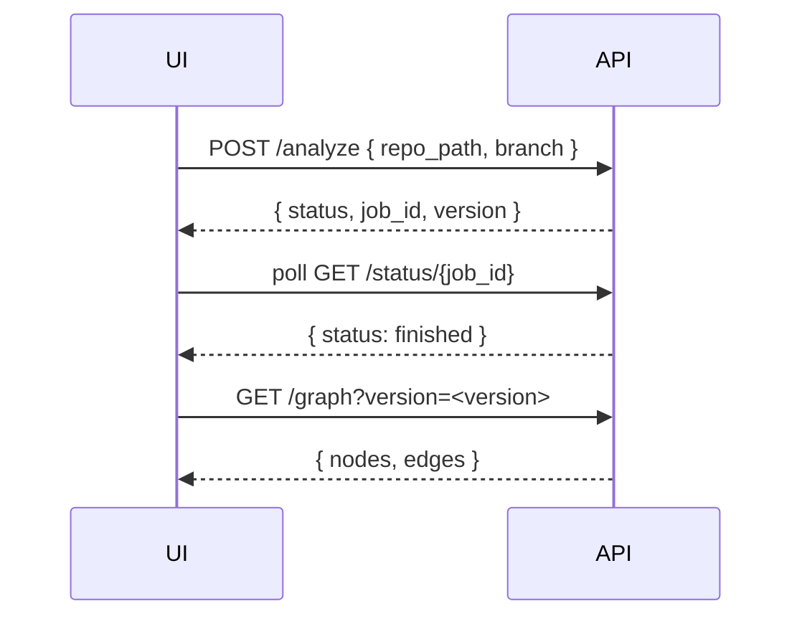

# Backend Integration Guide

This document describes how to fully integrate `code-intel-desktop` with the backend repository at `D:\incubator\ai-llm\bmrtech-oss\code-intel` so repository selection drives graph loading, symbol search, and requirement generation.

## Goal

Make the desktop UI drive the backend pipeline end-to-end:

- choose a source repository
- ingest it into the backend
- wait for indexing
- load the code graph dynamically
- allow symbol/file selection from the file tree
- generate requirements from selected nodes

## Architecture overview



## Backend repo overview

The backend lives at `D:\incubator\ai-llm\bmrtech-oss\code-intel`.
Key backend code is in the `code_intel/` Python package, especially:

- `code_intel/api/server.py` — FastAPI server and REST endpoints
- `code_intel/core/workspace.py` — workspace management and version state
- `code_intel/worker/tasks.py` — ingestion and requirement generation tasks
- `code_intel/core/storage.py` — versioned storage and query helpers
- `code_intel/mcp/server.py` — MCP / semantic search / topological adapter
- `code_intel/settings.py` — backend configuration and CORS origins

## Relevant backend API endpoints

### 1. Repository ingestion

`POST /analyze`

Request body:

```json
{
  "repo_path": "<local-path-or-git-url>",
  "branch": "main",
  "version": "optional-version-name"
}
```

Response:

- `status`: indexing started
- `version`: backend version token
- `job_id`: ingestion job identifier

This endpoint starts repository ingestion either from a local path or a Git URL. For frontend integration, this is the first call after repository selection.

### 2. Ingestion status

`GET /status/{job_id}`

Response fields:

- `status`: queued/running/finished/failed
- `result`: result payload when finished

Use this endpoint to poll the ingestion job until the backend has indexed the repository.

### 3. Graph and query data

`POST /query`

Request body:

```json
{
  "rule": "query_call_graph",
  "symbol": "MyService",
  "commit_sha": "<version-or-commit>"
}
```

Supported rules in server implementation:

- `query_call_graph`
- `transitive_calls`
- `dead_code`
- `impact`
- `get_symbols`
- `query_cross_repo_imports`
- `predict_impact`
- `verify_impact`
- `predict_next_edit`

This is the backend’s primary mechanism for retrieving graph and symbol data.

### 4. Requirements generation

`POST /requirements`

Query parameters:

- `version`: optional version or commit SHA

Returns:

- `job_id`
- `status`

Then poll:

`GET /requirements/status/{job_id}`

Response includes:

- `status`: pending/completed/failed
- `result`: generated requirement output once finished

### 5. Traceability

`GET /trace/{requirement_id}`

Returns the symbols tied to a requirement.

### 6. Search

`GET /search?q=<query>&limit=5`

Returns semantic search results from the backend’s semantic search engine.

### 7. Impact prediction

`GET /analytics/predict-impact?symbol=<symbol>&commit_sha=<sha>`

Returns impact prediction results from the backend.

## Integration strategy for `code-intel-desktop`

### Step 1: backend URL configuration

Ensure the frontend points at the backend service URL, for example:

- `http://localhost:8000`

In the desktop app settings, `code-intel-server-url` should be set to the backend API base URL.

### Step 2: repository selection flow

The desktop UI should support two repository selection modes:

1. `Browse repo` — choose a local repository path using Tauri’s native file dialog
2. `Show demo project` — fallback to a demo or mock project

For local repository selection, the app should send an ingestion request to `/analyze`.

Example flow:

1. user selects repository path
2. frontend sends `POST /analyze` with `repo_path` and optional `branch`
3. backend responds with `job_id` and `version`
4. frontend polls `GET /status/{job_id}` until ingestion is complete
5. once complete, frontend requests graph data for the returned version



### Step 3: backend-driven graph loading

The current frontend uses `CodeIntelService.getGraph()` to load graph data. To fully integrate, replace or extend this behavior to call backend graph/query endpoints.

Recommended backend feature to add (or reuse existing query rules):

- `GET /graph?version=<version>` or
- `POST /query` with `rule: "query_call_graph"`

The frontend should then convert backend results into the Cytoscape node/edge format used by the UI.

If the backend does not already expose a graph endpoint, implement one using `query_call_graph` or `get_symbols` + call relationships.

### Step 4: file tree and repo metadata

The frontend file tree should represent the selected repository and not only a demo placeholder.

Preferred integration paths:

- use local path selection in the Tauri app to build a file tree from disk and display repository files
- optionally provide a backend endpoint like `GET /repo/tree?version=<version>` that returns source path metadata from the backend ingestion

File tree nodes should include:

- file path
- symbol IDs or file metadata
- click handling that focuses the graph on the selected symbol or file

The backend can also make this stronger by exposing symbol-to-file mappings so file clicks can resolve into graph selections.

### Step 5: requirement generation from selected nodes

Once the repository is ingested and the graph is loaded, the requirement generation flow should use backend LLM generation.

Current backend path:

1. POST `/requirements?version=<version>`
2. poll `/requirements/status/{job_id}`
3. display `result` once completed

```mermaid
flowchart TD
    A[UI selects nodes] -->|POST /requirements| B[Backend LLM queue]
    B --> C[LLM worker] --> D[Requirement artifact persisted]
    D --> E[GET /requirements/status/{job_id}]
    E --> A
``` 

Because the backend is a job queue, the frontend should show progress and possibly allow cancellation if the backend supports it.

### Step 6: dynamic state propagation

A full integration should preserve the selected repository identity across the app:

- store the backend version/commit returned by `/analyze`
- pass that version into every subsequent request
- use the same version for graph, `query`, `requirements`, `search`, and impact predictions
- update the UI source label to show the selected repo version and backend source

## Recommended backend enhancements for better frontend integration

To make the desktop app drive everything from repo selection to requirements generation, the backend should expose a few frontend-friendly endpoints:

- `GET /graph?version=<version>`
  - return nodes and edges in a simple JSON shape for Cytoscape.
- `GET /symbols?version=<version>`
  - return symbol metadata for search, detail panels, and tree mapping.
- `GET /repo/tree?version=<version>`
  - return folder/file structure and optionally symbol associations.
- `POST /analyze` should accept both local path and Git URL, and return a stable `version`.
- `POST /requirements` and `/requirements/status/{job_id}` should remain the frontend contract for requirement generation.

## How the current backend implementation maps to the desktop app

### Ingestion

`code_intel/api/server.py` implements `/analyze`.
- local repo paths are accepted
- Git URLs are cloned with `GitRepoHandler`
- ingestion is queued with `run_ingestion`
- the response includes `job_id` and `version`

### Status polling

`/status/{job_id}` returns the queue status from `rq`.

### Query engine

`/query` is powerful and can be used for graph, symbol, dead-code, and impact queries.
The desktop app should call `/query` with the right rule after ingestion.

### Requirements

`/requirements` creates a background LLM generation job in `llm_queue`.
`/requirements/status/{job_id}` returns the final requirements result.

### Search

`/search` uses the backend semantic search engine and is available for natural language queries.

## Minimal frontend implementation plan

1. Update `CodeIntelService` to support backend REST calls:
   - `POST /analyze`
   - `GET /status/{job_id}`
   - `POST /query` or `GET /graph`
   - `POST /requirements`
   - `GET /requirements/status/{job_id}`
   - `GET /search?q=`

2. Add a repository selection dialog in the Tauri frontend.
3. On repo selection, call `/analyze` and keep `version` and `job_id`.
4. Poll `/status/{job_id}` until ingestion completes.
5. After ingestion, load graph data from the backend for that version.
6. Wire file tree clicks to graph selection, using symbol IDs or file metadata as available.
7. Wire requirement generation to the backend job API and display results.

## Example integration workflow

1. user chooses repo path
2. frontend sends:

```js
await fetch(`${baseUrl}/analyze`, {
  method: 'POST',
  headers: { 'Content-Type': 'application/json' },
  body: JSON.stringify({ repo_path: selectedPath, branch: 'main' })
});
```

3. frontend polls `/status/{job_id}` until ready.
4. frontend loads the graph:

```js
const graph = await fetch(`${baseUrl}/graph?version=${version}`).then(r => r.json());
```

5. frontend builds the file tree and binds file symbols to graph nodes.
6. user selects nodes and requests requirements.
7. frontend sends:

```js
const req = await fetch(`${baseUrl}/requirements?version=${version}`, { method: 'POST' });
```

8. frontend polls `/requirements/status/{job_id}` and displays `req.result` when completed.

## Notes for the current app

- The frontend currently uses `demoMode` and mock graph data for initial rendering.
- The backend should replace that mock path by providing a real graph endpoint and query rules.
- Since the backend already supports local repo ingestion, use Tauri file-system access instead of browser-only file inputs when available.

## Prompts for AI Agents

Use these phased prompts when asking an AI agent to implement the integration. Each phase is intentionally small and focused, suitable for a compact agent context.

### Phase 1: Evaluate repositories and surface integration points

Prompt:

> Review the frontend repository at `code-intel-desktop` and the backend repository at `code-intel`. Identify the existing boundaries between UI, graph loading, and backend API. Produce a short implementation plan that follows these principles:
> 1. rich hickey simplicity — prefer clear, composable modules over clever complexity.
> 2. antinodelabs.com signal over noise — remove distractions, keep only what adds value.
> 3. unix do one thing well — each step should solve a single integration responsibility.

### Phase 2: Define minimal API contract and version flow

Prompt:

> Based on the repositories, define the smallest backend API contract needed for the desktop app to:
> - ingest a selected repo
> - poll ingestion status
> - load graph data for a specific version
> - request requirement generation
> Keep the contract lean and make it easy for the frontend to use.

### Phase 3: Plan implementation tasks for the frontend

Prompt:

> Propose a phased frontend task list for `code-intel-desktop` that starts from repo selection and ends with requirement generation.
> Each task should be a single step with a clear output, such as "add repo selection and call /analyze" or "render graph data from backend result".
> Avoid suggesting large refactors; keep each phase small and verifiable.

### Phase 4: Validate and iterate on API usage

Prompt:

> Review the proposed frontend/backend integration and identify any missing API fields, version handling edge cases, or user-feedback points.
> Suggest the next small change to make the plan more robust while staying aligned with simplicity and signal-over-noise.

## Conclusion

This integration should make the desktop UI a true frontend for the Code-Intel backend. The key is to let repository selection trigger backend ingestion, then use the returned `version` for all graph, query, and requirement workflows.

By adding a lightweight `GET /graph` endpoint and a repo tree API, the UI can become fully dynamic and backend-driven.
