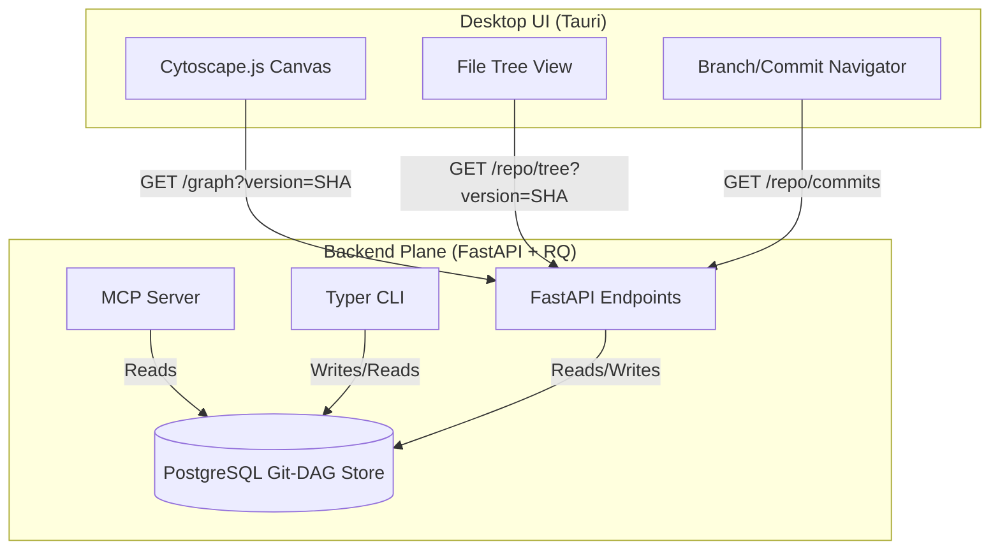

# Master Integration Specification: Code-Intel Desktop & Backend Integration

This specification compiles all previous findings, architectural designs, and product engineering principles (Rich Hickey’s Simplicity, Unix "Do One Thing Well", and 100% Signal vs. Noise) into a single, comprehensive Master Integration Document. It maps out the exact changes needed in both the Desktop and Backend apps, while detailing all integration surfaces (HTTP REST API, MCP Server, CLI, etc.).

---

## 1. Core Integration Architecture

The architecture relies on the **Unified Data Plane** model, decoupling the immutable Git-DAG topological data from ephemeral UI representation.

---

## 2. Desktop Application: Required Changes

To transform the current mock-heavy desktop app into a high-signal production console, the following changes are required:

### A. UI Configuration & Zero-State Layout (Signal Focus)
* **Remove Mock Defaults:** Purge all mock nodes and edges from `main.js`.
* **State Simplification:** Replace multi-variable state managers with a single immutable coordinate: `(selectedRepoPathOrUrl, selectedCommitSHA)`.
* **The "Zero-Noise" Canvas:** Ensure that on initial load, the Cytoscape canvas is entirely empty. It should only render nodes upon explicit selection from the file tree or search bar, ensuring a 100% signal ratio.

### B. Connection & Host Discovery Panel
* **Automatic Service Detection:** On startup, the UI issues a lightweight fetch to `${baseUrl}/status`.
* **Container Environment Helper:** If the backend reports running inside Docker, Tauri automatically intercepts file paths to ensure correct shared volume mount mappings (translating host paths to container paths).

### C. Live Ingestion Screen (Local & Remote Git Ingestion)
* **Progress Tracking:** Replace long-polling loops with a single SSE subscription hook to `/analyze/stream`.
* **Flexible Ingestion Inputs:** Provide inputs for:
  1. A local folder path (using Tauri native folder dialogs).
  2. A remote Git repository URL (HTTPS or SSH) along with an optional Target Branch field.
* **Metrics Dashboard:** Display live parsing counters: `Files Processed`, `Extracted Symbols`, and `Call Relationships`.

### D. Git-DAG Navigation Panel
* **Branch Select Menu:** A new dropdown listing available repo branches.
* **Timeline Travel Rail:** A vertical commit rail displaying chronological commit nodes with author and SHA hashes. Switching elements dynamically triggers redrawing of the active views.

### E. Level-of-Detail (LOD) Graph Controller
* **LOD Queries:** Modify Cytoscape loading logic to only request FileNodes initially.
* **Lazy Node Expansion:** Double-clicking file nodes fetches local definitions and draws them on demand, keeping memory utilization minimal.

---

## 3. Backend Service: Required Changes

To support the highly focused desktop client, the backend must expose a few frontend-friendly, atomic endpoints:

### A. New Integration Endpoints
1. **`GET /repo/tree?version=<commit_sha>`**
   * **Purpose:** Returns the complete directory file tree metadata as a structured JSON object.
   * **Signal Payload:** Maps files directly to their contained symbol IDs, enabling instant tree-to-graph clicks.
2. **`GET /graph?version=<commit_sha>`**
   * **Purpose:** Directly aggregates current symbols and calls, returning a structured JSON format ready for instant Cytoscape.js ingestion.
   * **Format:** `{"nodes": [{"id": "...", "label": "...", "type": "..."}], "edges": [{"source": "...", "target": "...", "type": "..."}]}`
3. **`GET /repo/branches-and-commits`**
   * **Purpose:** Queries the Git-DAG model and returns all branches and chronological lists of parent/child commit SHAs.

### B. Path & Remote Cloner Translation Registry
* **Path Translation:** Implement a routing helper that automatically maps host directories (passed by Tauri native dialogue) into backend-accessible folder mounts or processes uploaded ZIP payloads natively.
* **Git Clone Workspace Manager:** Expose `/analyze` to accept Git remote URLs, clone them to background workspaces using the `GitRepoHandler`, and clean up transient directories after ingestion completion.

---

## 4. Integration Surfaces & Communication Protocols

### Surface 1: HTTP REST API (Data-Driven Queries)
* The primary surface for transactional mutations (e.g. initiating ingestion, checking job progress, performing GQL lookups).
* **Versioning Mandate:** Every payload query must explicitly enforce `version` parameter propagation to avoid state collisions across concurrent developers.

### Surface 2: Model Context Protocol (MCP) Server
* First-class integration with AI assistants (e.g., Claude Code, Cursor) using the `FastMCP` framework.
* **Context Preservation:** All tools (like `query_call_graph`, `query_dead_code`, and `query_impact`) must support an optional `commit_sha` argument. If omitted, it resolves automatically to the client's active workspace commit from Redis.

### Surface 3: Typer CLI (Headless Operations & CI)
* Fully matches REST capabilities. Useful for headless scripting and CI validation gates:
  * `code-intel analyze /path/to/repo --summarize` (Populates data plane).
  * `code-intel scan --format sarif` (Security and complexity reports).
  * `code-intel coverage --threshold 80` (Fails CI if coverage is insufficient).

### Surface 4: Server-Sent Events (SSE) / Streams (Real-Time Push)
* Employs chunked streaming for heavy tasks:
  * **Ingestion:** `/analyze/stream` provides live AST progress updates.
  * **Requirements Generation:** `/requirements/stream` provides token-by-token LLM output with precise grounding provenance.

---

## 5. Architectural Risk & Mitigation Profile

| Potential Failure | Impact | Mitigation Strategy (The Simple Way) |
|---|---|---|
| **High Density Canvas Freeze** | High | **Immediate Depth Limit:** Clamp network rendering to depth=1 by default; let developers expand nodes manually. |
| **CORS Handshake Blocks** | Medium | **Tauri HTTP Client:** Leverage Tauri's native rust-based HTTP plugin to perform requests, which completely bypasses browser-level origin checks. |
| **Path Mapping Failures** | High | **Native Upload Fallback:** If Docker folder mapping fails, fallback to uploading a compressed ZIP representation of the codebase. |
